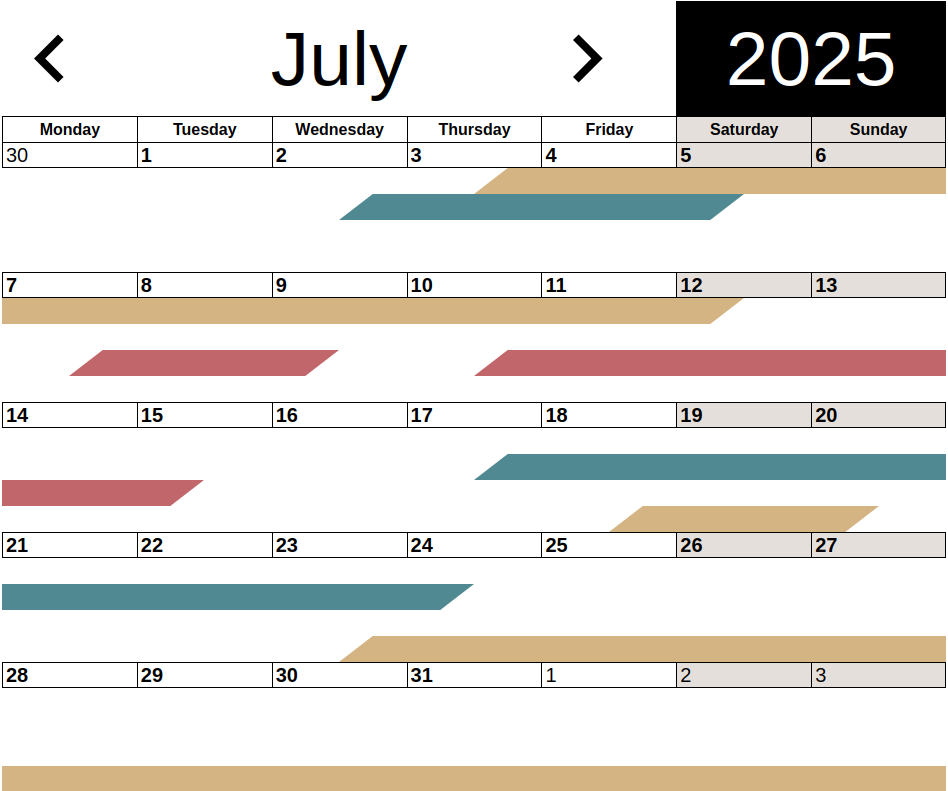

# GuestCalendar
GuestCalendar is a vue calendar to see the booked dates of your guest
rooms!


## Features
GuestCalendar features are:
- Month and Year selection
- optimized for mobile and desktop
- custom weekstart
- uses client language and date formats
- detailed information of an event by clicking on it

## GuestCalendar in your project
### Install
Clone the repository. Then run:
```
npm run build
npm pack
```
npm pack will create a file install this file with:
```
npm install /path/to/created/file
```
### Configuration
In the .dev directory is an exemple app how to use GuestCalender.
With
```
npm run dev
```
you can run the app and test GuestCalendar.
#### Properties
GuestCalendar has the following properties:
- events: defines the dates the rooms are already booked. Implements the EventItem interface: 
```
interface EventItem {
  id: number,
  room: number,
  start: Date,
  end: Date,
}
```
- start-of-the-week: with which weekday a week starts. By default Monday.
- time-slots: The number of your guest rooms

#### Events
- calendar-date-change: Is called when the viewed month/year changes in 
the calendar. It provides the new viewed month as seperate arguments (year, month). You can call here your API to load events of the newly
selected month.
## Project setup
```
npm install
```
### Run development server and live demo
```
npm run dev
```
and visit the url provided by vite to see a live demo of GuestCalendar.

### Compiles and minifies for production
```
npm run build
```

### Lints and fixes files
```
npm run lint
```